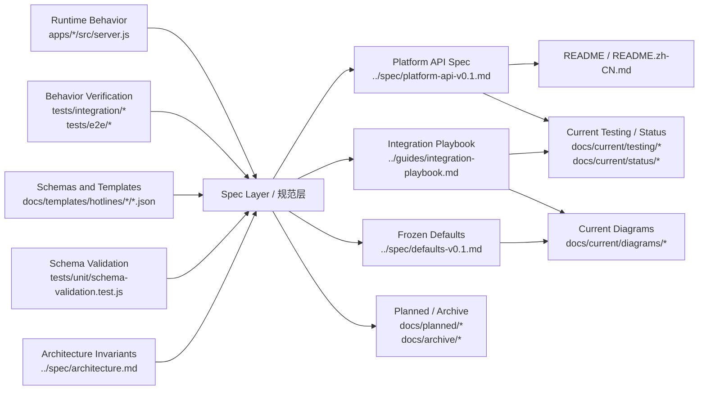

# Documentation Truth Source Map

本文档说明仓库内“真相源”和“衍生物”的分层关系，避免多个文档重复定义同一事实。

## 分层规则

- 真相源负责定义“系统实际上是什么”
- 规范层负责把真相源整理成稳定可读的规范
- 说明层负责面向不同读者传播，不得自行发明事实

## 结构图

## 判定规则

- 接口实际返回什么：以 `apps/*/src/server.js` 和 integration/e2e tests 为准
- 模板输入输出长什么样：以 `docs/templates/hotlines/*/*.json` 和 schema 校验测试为准
- 系统不变量、模式边界、信任模型：以 `../spec/architecture.md` 为准
- `../spec/platform-api-v0.1.md`、`../guides/integration-playbook.md`、`../spec/defaults-v0.1.md` 必须贴合上述真相源
- `docs/planned/*` 只描述尚未成为当前行为真相的设计，不得定义当前协议事实
- `docs/archive/*` 只用于历史快照，不得作为当前实现判断入口
- `README`、图、checklist、tracker 只能转述，不应扩展协议事实
