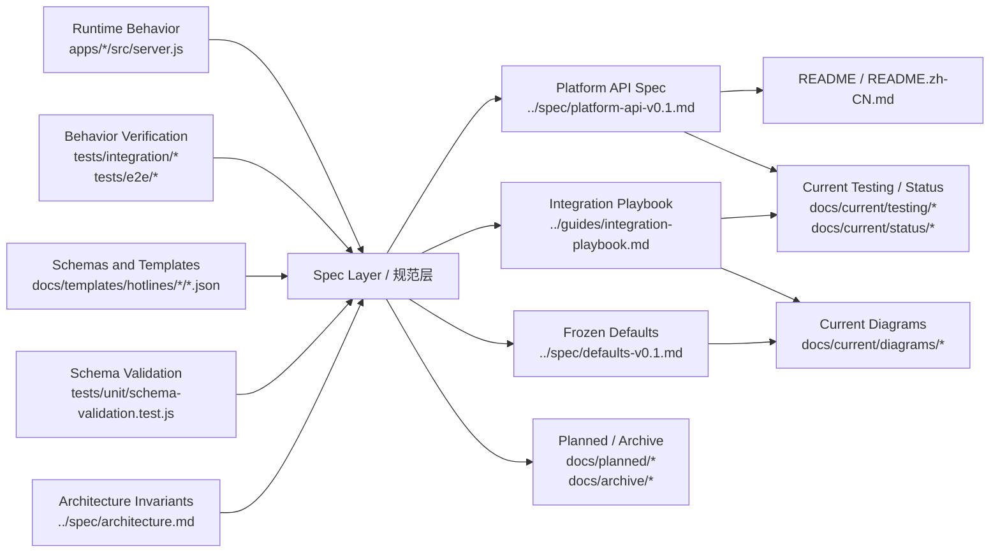

文档真相来源图

> 英文版：[doc-truth-source-map.md](doc-truth-source-map.md)
> 说明：中文文档为准。

# 文档真相来源图

本文档说明仓库内“真实源”和“合理性”的分层关系，避免重复文档重复定义相同的事实。

## 分层规则

- 真相源负责定义“系统实际是什么”
- 规范层负责把真相源治理纳入稳定的规范
- 说明层负责面向不同读者传播，不得自己发明事实

## 结构图

## 判定规则

- 接口实际返回什么：以`apps/*/src/server.js`和integration/e2e测试相同
- 模板输入输出长类型：以 `docs/templates/hotlines/*/*.json` 和 schema 验证测试一致
- 系统不变量、模式边界、信任模型：以 `../spec/architecture.md` 相似
- `../spec/platform-api-v0.1.md`、`../guides/integration-playbook.md`、`../spec/defaults-v0.1.md` 必须贴合上述真相来源
- `docs/planned/*` 只描述尚未成为当前行为真相的设计，不得定义当前协议事实
- `docs/archive/*` 只用于历史快照，不得作为当前实现判断入口
- `README`、图、checklist、tracker只能转述，不宜扩展协议事实
