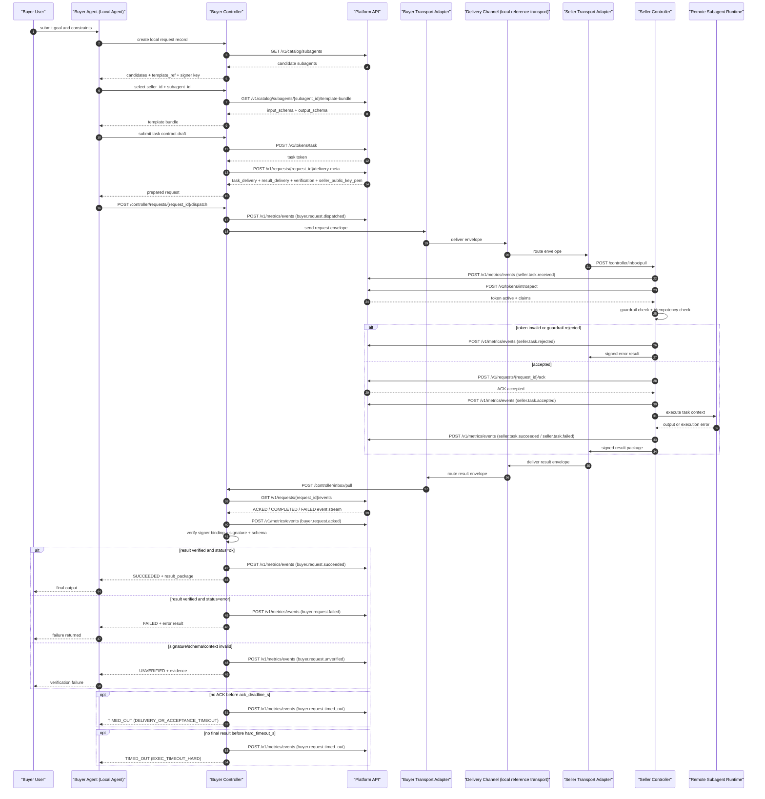

实施的呼叫流程

> 英文版：[implemented-call-flow.md](implemented-call-flow.md)
> 说明：中文文档为准。

# 实现的调用流程

本图只描述当前仓库已经实现并通过验证的最小闭环：

- Buyer Agent（本地代理）通过 Buyer Controller 编排协议调用
- Platform API 负责目录、token、delivery-meta、ACK events、heartbeat、metrics
- Delivery Channel实例当前是本地参考transport
- 卖方控制器负责解码、鉴权、ACK、队列、执行器调度、签名回包
- Remote Subagent 在当前已实现基线中执行 Seller Runtime 内部挂载的执行器/工作流程/代码设施

