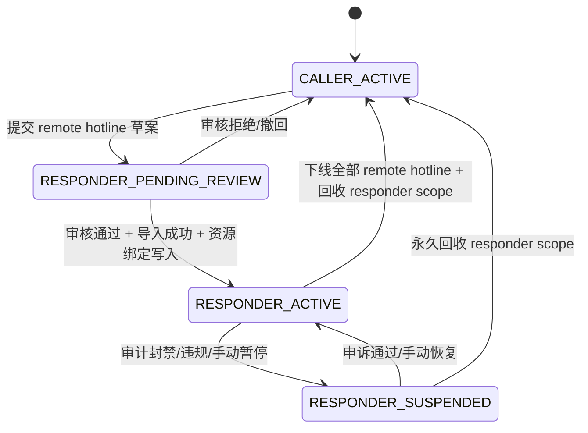
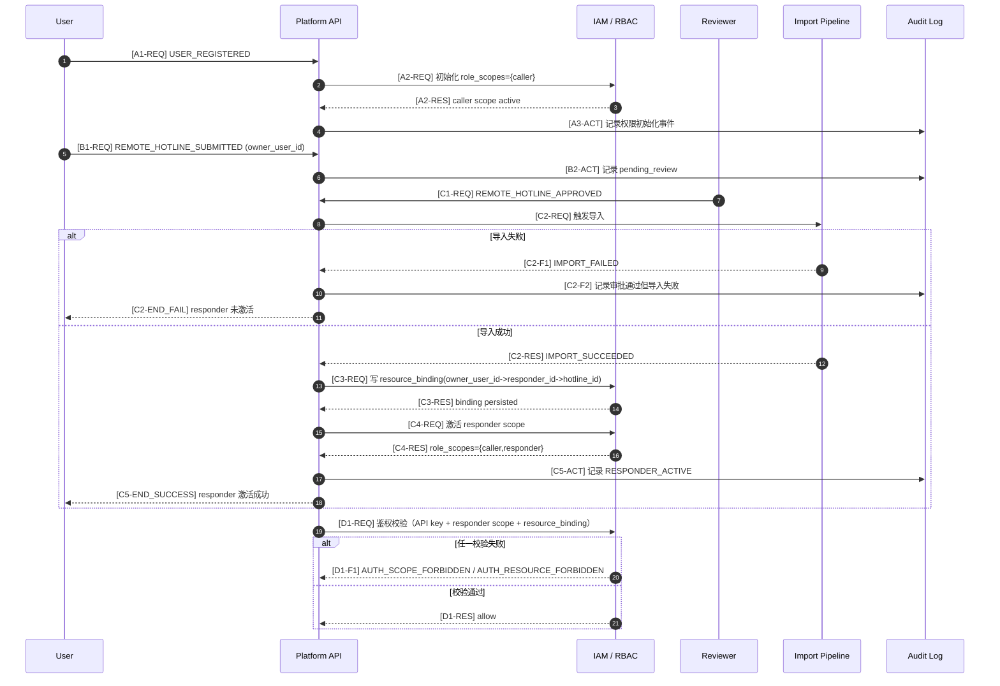

# Permission Lifecycle & RBAC Call Flow

## 目标

- 将权限模型从业务主流程中拆分，独立描述“权限从哪里来、何时变化、如何校验”。
- 主流程图仅保留鉴权闸门，细节以本文件为准。

## 核心对象

- `user_id`：用户主体
- `role_scopes`：角色权限集合（`caller`、`responder`）
- `resource_binding`：资源归属关系（`owner_user_id -> responder_id -> hotline_id`）
- `api_key_fingerprint`：API Key 指纹（明文 key 只在签发时返回）

## 权限状态机

## 触发事件与变更规则

- `USER_REGISTERED`（来源：Platform API）  
  变更：创建 `user_id`，初始化 `role_scopes={caller}`。
- `REMOTE_HOTLINE_SUBMITTED`（来源：Responder User/Portal）  
  变更：进入 `RESPONDER_PENDING_REVIEW`（不授予 responder scope）。
- `REMOTE_HOTLINE_APPROVED` + `CATALOG_IMPORTED`（来源：Reviewer + Import Pipeline）  
  变更：写入 `resource_binding`，激活 `responder` scope，进入 `RESPONDER_ACTIVE`。
- `REMOTE_HOTLINE_REJECTED`（来源：Reviewer）  
  变更：保持/回到 `CALLER_ACTIVE`。
- `RESPONDER_ACCESS_SUSPENDED`（来源：Risk/Ops）  
  变更：`RESPONDER_ACTIVE -> RESPONDER_SUSPENDED`。
- `RESPONDER_ACCESS_RESTORED`（来源：Ops）  
  变更：`RESPONDER_SUSPENDED -> RESPONDER_ACTIVE`。
- `RESPONDER_SCOPE_REVOKED`（来源：Ops/Policy）  
  变更：移除 `responder` scope，回到 `CALLER_ACTIVE`。

## 权限变更时序图（v1.1）

编号后缀：

- `-REQ`：请求消息
- `-RES`：响应消息
- `-ACT`：本地动作
- `-S*`：成功分支事件
- `-F*`：失败分支事件
- `-END_SUCCESS | -END_FAIL`：终态

## 接口权限矩阵（最小集）

- `GET /v2/hotlines`：需要 `caller`
- `POST /v1/tokens/task`：需要 `caller`
- `GET /v1/requests/{request_id}/events`：需要 `caller`
- `POST /v1/tokens/introspect`：需要 `responder` + 资源归属命中
- `POST /v1/requests/{request_id}/ack`：需要 `responder` + 资源归属命中
- `POST /v2/responders/{responder_id}/heartbeat`：需要 `responder` + `owner_user_id -> responder_id` 命中
- `POST /v1/metrics/events`：`caller` 或 `responder`（按 `source` 与资源归属校验）
